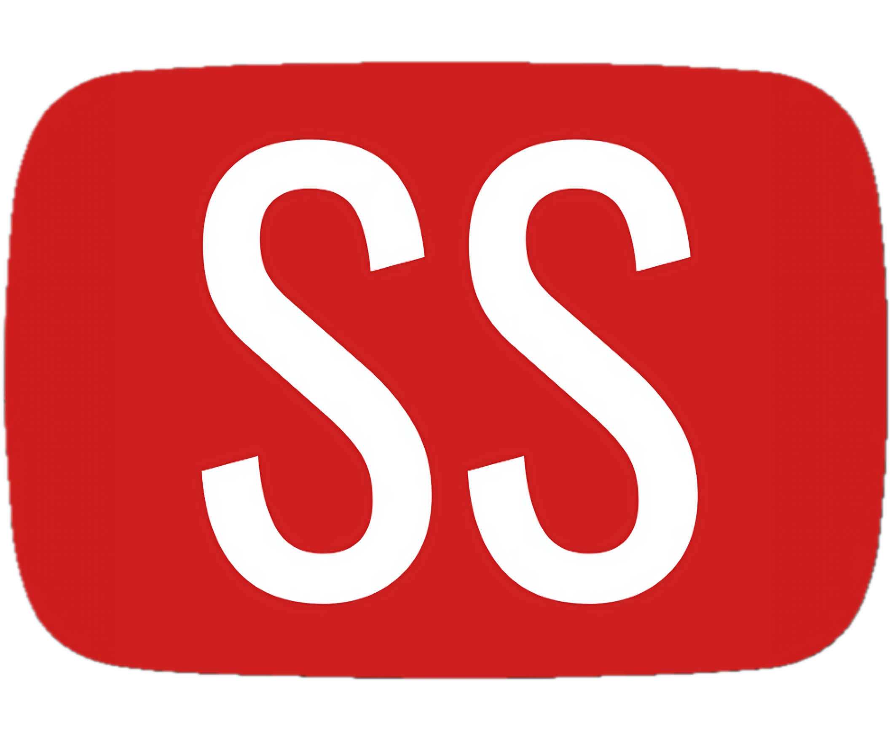
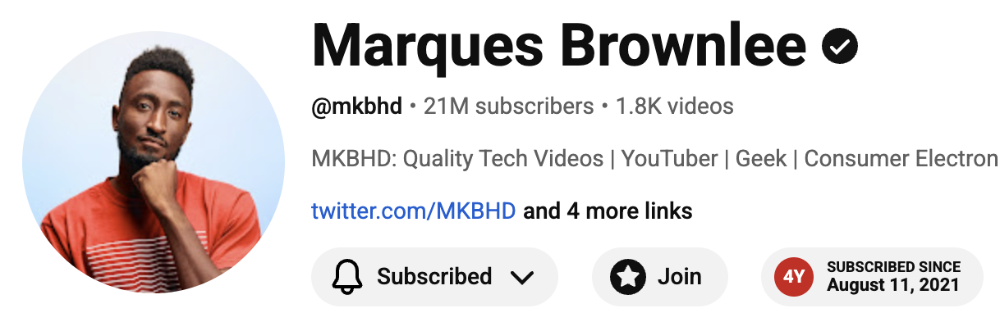

<p align="center">
  
</p>
<h1 align="center" style="color:red;">
  Subscribed Since
</h1>

<!--[Chrome Web Store](TODO) · [Firefox Add-ons](TODO) · [Microsoft Edge Add-ons](TODO)-->

Subscribed Since is an open-source Chrome extension that shows when you
subscribed to a YouTube channel directly on YouTube channel pages.

The extension uses read-only YouTube access to fetch your subscription list and
subscription timestamps, then displays the relevant subscription date beside the
channel controls.



## Usage

1. Open the Subscribed Since menu from the extensions toolbar.
2. Sign in with Google to your YouTube account.
3. Visit a YouTube channel homepage (refresh if needed).
4. If you are subscribed to that channel, the extension shows your subscription
   date on the page.

## Privacy

Subscribed Since requests this Google OAuth scope:

```text
https://www.googleapis.com/auth/youtube.readonly
```

The extension uses this read-only scope only to retrieve your YouTube
subscriptions and their `publishedAt` subscription timestamps from the YouTube
Data API.

Subscription data is stored locally in your browser using Chrome extension local
storage:

```text
chrome.storage.local["ss-cache-state"]
```

Subscribed Since does not upload your subscription data to an external server,
sell it, share it with third parties, or use it for advertising.

To inspect the local cache while developing or debugging, open the extension's
service worker DevTools console from `chrome://extensions` and run:

```js
chrome.storage.local.get("ss-cache-state").then(console.log);
```

To clear the local cache:

```js
chrome.storage.local.remove("ss-cache-state");
```

## Permissions

Subscribed Since uses these Chrome extension permissions:

- `identity`: sign in with Google through Chrome's Identity API.
- `storage`: store subscription metadata locally in the browser.
- `alarms`: refresh subscription metadata periodically.
- `*://*.youtube.com/*`: display subscription dates on YouTube pages.
- `https://www.googleapis.com/*`: call the YouTube Data API.

## Contributing

Contributions are welcome. If you find a bug, have an idea for improving the
YouTube page integration, or want to make the popup clearer, feel free to open an
issue or pull request.

For code changes:

1. Fork the repository.
2. Create a feature branch.
3. Install dependencies with `npm install`.
4. Run the extension locally with `npm run dev`.
5. Check your changes with `npm run compile` and `npm run build`.
6. Open a pull request with a short description of what changed and how you
   tested it.

Please keep privacy and permissions in mind when contributing. The extension
should continue to request the minimum access needed, store subscription data
locally, and avoid sending YouTube account data to external services.

## License

Licensed under the Apache License, Version 2.0. See [LICENSE](./LICENSE).
